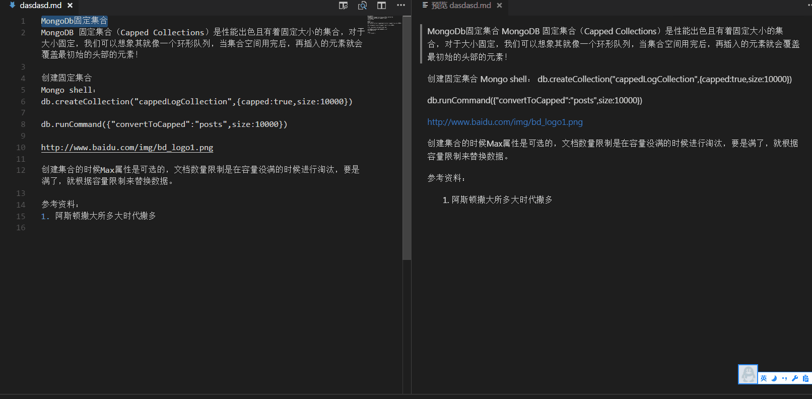

# markdown-helper README
A VSCode plug to improve the efficiency of writing Markdown documents.

## Features

1. Color the selected text.

2. Some functions to add md synatx of the text.Such as h1,h3,link,img...

3. Insert snippet of the table, if u alway forget how to wirte a  table in markdow files.

4. Support emoji.

-----------------
中文说明
1. 给选中的文本添加颜色
2. 给选中的文本提供一些常用函数，比如添加大标题，中标题，高亮代码，转图片，转链接等
3. 插入table的语法片段
4. 支持emoji

## Release Notes

Users appreciate release notes as you update your extension.

### 1.0.0

Initial release of ...

-----------------------------------------------------------------------------------------------------------

## KeyBindings

* Insert table snippet (`Cmd+shift+t` on OSX or `Ctrl+shift+t\` on Windows and Linux)
* Color The text (`Cmd+shift+c` on OSX or `Shift+Ctrl+c` on Windows and Linux)
* Text functions `Cmd+shitf+w` (Windows, Linux) or `Shift+Ctrl+w` (OSX) to 

## Changelog
### 1.0.0

- **New**: pubilish
- **Chore**: update version

### For more information

* [Visual Studio Code's Markdown Support](http://code.visualstudio.com/docs/languages/markdown)
* [Markdown Syntax Reference](https://help.github.com/articles/markdown-basics/)

**Enjoy!**